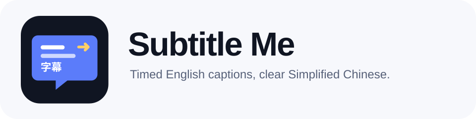
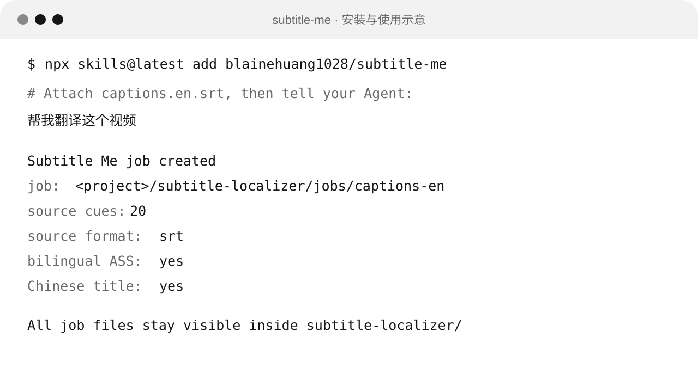
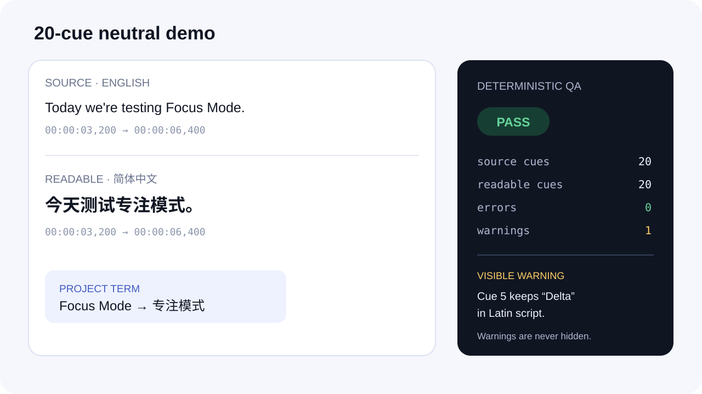

<p align="center">
  <picture>
    <source media="(prefers-color-scheme: dark)" srcset="./skills/subtitle-me/assets/logo-dark.svg">
    <source media="(prefers-color-scheme: light)" srcset="./skills/subtitle-me/assets/logo-light.svg">
    
  </picture>
</p>

<p align="center">
  <a href="https://github.com/blainehuang1028/subtitle-me/actions/workflows/test.yml"></a>
  
  
  <a href="./LICENSE"></a>
</p>

<p align="center">
  把带时间轴的英文字幕交给你的 Agent，拿回经过术语治理、独立审校和确定性 QA 的简体中文字幕。
</p>

<p align="center">
  <a href="#安装">安装</a> ·
  <a href="#怎么用">教程</a> ·
  <a href="#会生成哪些文件">产物</a> ·
  <a href="#兼容性">兼容性</a> ·
  <a href="#english">English</a>
</p>

## 安装

```bash
npx skills@1.5.18 add blainehuang1028/subtitle-me
```

装好后，把 SRT、WebVTT、YouTube JSON3 或 ASS 字幕文件交给 Agent，然后说：

```text
帮我翻译这个视频
```

你也可以说得更具体：

```text
用 subtitle-me 把 captions.en.srt 翻译成简体中文，需要中英双语 ASS，也请给我一个中文标题。
```

Subtitle Me 是一个 [Agent Skill](https://agentskills.io/specification)。翻译由你正在使用的 Agent 完成，Node 脚本负责字幕格式、时间轴、术语记录、可读性处理和 QA。运行时不需要额外的 npm 依赖。

字幕内容、文件名和项目参考资料都会被当作不受信任的数据处理，不会被当成命令执行。联网查术语仍需先征得你的同意。



## 怎么用

### 1. 提供带时间轴的英文字幕

默认支持 SRT 和 WebVTT，也可以读取 YouTube JSON3。ASS 输入只提取对白，原来的样式、定位和特效不会保留。

只有视频或视频链接还不够。`v0.1.0` 不做语音识别，也不下载视频。Agent 会提醒你先提供带时间轴的字幕文件，并可以推荐字幕导出方法。

### 2. 一次选好可选产物

开始前，Agent 会用一个简短问题确认素材，以及是否需要双语 ASS 和中文标题。默认交付简体中文 SRT、项目术语库和 QA 报告。

### 3. 集中确认有歧义的术语

每个项目的术语库都从空白开始。Agent 只提取人名、品牌、功能名和领域术语。已有术语会被强制执行，新术语如果有歧义，会集中向你确认一次。

项目资料和你提供的参考文件优先。确实需要联网查术语时，Agent 会先征求同意，只查公开的官方来源，不会把整份字幕或私有项目内容发给第三方搜索服务。

### 4. 等待翻译、第二轮审校和 QA

第一轮生成忠实的语义字幕，第二轮重新对照英文和中文，检查漏译、误译、数字、人名、术语和中文表达。最后再运行确定性 QA。术语没有解决、审校没有完成或字幕结构出错时，任务不会显示通过。



截图来自仓库内原创的 20 条中性示例。QA 通过时仍可能带有需要结合上下文查看的警告，最终交付不会隐藏这些警告。

## 会生成哪些文件

所有文件都放在当前项目可见的 `subtitle-localizer/` 目录，不会藏进用户目录：

```text
subtitle-localizer/
  README.md
  glossary.json
  glossary.md
  glossary.changes.jsonl
  jobs/<job-id>/
    job.json
    source/source.en.srt
    subtitles/semantic.zh-Hans.srt
    subtitles/readable.zh-Hans.srt
    subtitles/readable.en.srt
    subtitles/bilingual.zh-en.ass       可选
    qa/term-candidates.json
    qa/term-decisions.json
    qa/ai-review.json
    qa/qa.json
    title.zh-Hans.md                    可选
    report.md
```

`semantic.zh-Hans.srt` 保留源字幕的分段和时间轴，是翻译主版本。`readable.zh-Hans.srt` 只处理屏幕阅读体验，可以在同一条源字幕的时间范围内重新切分。

如果选择中文标题，`title.zh-Hans.md` 只保存一组原文与中文标题：

```text
Original: <original title>
Chinese: <natural Simplified Chinese title>
```

`glossary.json` 是术语权威文件，`glossary.md` 只供阅读，`glossary.changes.jsonl` 记录每次正式修改。`job.json` 只记录当前进度，不保存文件哈希。修改字幕、术语、标题或 ASS 后，重新运行受影响的生成步骤和最终 QA 即可。再次运行 `init` 时，如果规范化后的源字幕内容有变化，后续阶段会重置为待处理；上一轮术语记录和 AI 审校摘要会保留在重置后的 JSON 中供参考。

同一个项目请一次只运行一条 Subtitle Me 命令，避免同时修改术语库或同一份任务文件。

## 字幕可读性

中文默认保持单行，目标为 16 个显示单位，单行最多 24 个显示单位。切分优先选择标点和自然语义边界，不会切断已确认术语、英文单词或数字单位。

如果强行拆开会破坏意思，可以明确保留两行作为例外，QA 会把它列为警告。双语 ASS 最多只能显示一行中文和一行较小的英文，因此中文两行例外会阻止 ASS 生成。

## 双语 ASS 与 FFmpeg

ASS 默认使用白字、细黑描边和透明背景，不会生成遮挡画面的黑色底板。生成 ASS 不需要 FFmpeg。

只有你要求渲染预览图时才会检查 FFmpeg。缺少 FFmpeg 时，Agent 必须先问你是否需要安装说明，不能自行安装。Subtitle Me 不负责把字幕烧录进视频。

## 兼容性

`Verified` 表示已经真实安装并运行过中性示例。`Compatible` 表示遵循对应 Agent 的 Skill 目录和 `SKILL.md` 规范，等待该客户端的真实冒烟测试。

| Agent | 安装方式 | 状态 |
| --- | --- | --- |
| Codex | `npx skills@1.5.18 add blainehuang1028/subtitle-me` | Verified on macOS |
| Hermes Agent | 同一条 npx 命令 | Compatible |
| OpenCode | 同一条 npx 命令 | Compatible |
| Pi | 同一条 npx 命令 | Compatible |
| OpenClaw | 同一条 npx 命令 | Compatible |
| Trae | 同一条 npx 命令 | Compatible |
| WorkBuddy | 从 GitHub Release 导入 ZIP | Compatible |

标准安装路径由 [skills CLI](https://github.com/vercel-labs/skills) 提供。WorkBuddy 包按其[官方 Skill 结构](https://open.workbuddy.cn/en/docs/skill)生成，每个版本的 GitHub Release 只提供一个可直接导入的 ZIP。

macOS、Windows 和 Linux 是发布门槛。GitHub Actions 会在三个系统上运行 Node 测试、仓库验证、安装冒烟测试和 WorkBuddy 打包检查。某个系统没有通过时，不发布版本。

## 开发与验证

```bash
npm test
npm run validate
npm run package:workbuddy
```

仓库没有生产 npm 依赖。发布开发工具 `skills` 以精确版本锁在 `devDependencies` 和 lockfile 中。测试使用 Node 内置的 `node:test`，中性示例从空术语库开始，不包含第三方字幕、真实项目名称或媒体文件。

## 当前边界

`v0.1.0` 只处理带时间轴的英文字幕到简体中文字幕。以下能力不在当前版本内：

- 语音识别和自动字幕生成
- 视频或字幕下载
- 字幕烧录、配音和 TTS
- 平台简介、标签、章节、上传和发布
- 全局术语库
- 任意语言对
- 特定 Agent 的私有钩子或受控模式

## License

[MIT](./LICENSE) © 2026 Kai Huang

---

## English

Subtitle Me is an Agent Skill for people who already use Codex, Hermes Agent, OpenCode, Pi, OpenClaw, Trae, or WorkBuddy. Give the Agent a timed English subtitle file and receive Simplified Chinese subtitles with project terminology, a separate AI review, and deterministic QA.

### Install

```bash
npx skills@1.5.18 add blainehuang1028/subtitle-me
```

Attach an SRT, WebVTT, YouTube JSON3, or ASS file and say:

```text
Translate this video with subtitle-me.
```

The Agent asks one compact preflight question about source material, optional bilingual ASS, and an optional Chinese title. The default delivery contains a readable Chinese SRT, project glossary, machine QA, and a human-readable report.

### What it does

- Translates English timed captions directly into Simplified Chinese.
- Starts each project with an empty, project-owned glossary.
- Records terminology decisions in JSON and an append-only journal.
- Keeps a source-aligned semantic SRT and a separate readable SRT.
- Requires a separate second AI review and deterministic QA.
- Optionally creates bilingual ASS with one Chinese row and one smaller English row.

### What it does not do

Version 0.1.0 does not perform ASR, download media, burn subtitles into video, create dubbing, upload to a platform, or translate arbitrary language pairs. ASS preview is the only feature that may need FFmpeg, and the Agent must ask before offering installation guidance.

### Visible project state

Every mutable artifact stays in `<project>/subtitle-localizer/`. The installed skill contains no terminology seed and never replaces a project's glossary. `job.json` records progress without file hashes. After editing an artifact, rerun its downstream steps and final QA. Running `init` again resets downstream phases when the normalized source text has changed while retaining the preceding terminology records and AI-review summary for reference.

Run one Subtitle Me command at a time for a given project; concurrent writes to the same glossary or job are not supported.

When a Chinese title is requested, `title.zh-Hans.md` contains exactly one pair: `Original: ...` and `Chinese: ...`.

### Compatibility

Codex is verified locally on macOS through the official `skills` CLI. Hermes Agent, OpenCode, Pi, OpenClaw, and Trae use the same Agent Skill package and are marked compatible until each receives a real smoke test. WorkBuddy receives a single release ZIP with its required metadata.

macOS, Windows, and Linux CI must pass before a release is published.

### Development

```bash
npm test
npm run validate
npm run package:workbuddy
```

The runtime uses Node.js 20 or newer and has zero production npm dependencies.
The release-only `skills` CLI is pinned as a development dependency and installed from the lockfile in CI.
